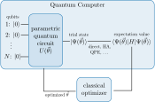
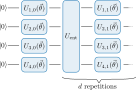
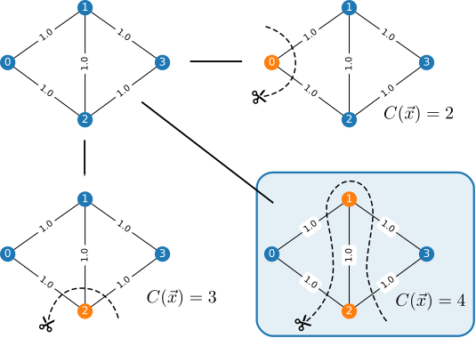
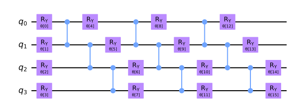

# What is VQE?

### Overview

What is VQE?

* variational hybrid quantum-classical algorithm
* aims to solve eigenvalue
* initially proposed to solve quantum chemistry problems [@peruzzo2014]
* makes even small quantum systems useful in conjunction with classical routines

### Sketch of the Algorithm

{ height=70% }

### Circuit Structure

{ height=50% }

### Applications

* quantum chemistry [@peruzzo2014; @mcclean2016]
* quantum magnets [@kandala2017]
* lattice gauge theories [@paulson2020]
* classical optimization problems [@farhi2014]

# Classical Problems

### Max-Cut Problem: Statement

> Given a weighted graph $G$, find the maximum cut.

$\Leftrightarrow$ Partition vertices in two sets, such that the sum of edge
weights between the sets becomes maximal.

$\Leftrightarrow$ Maximize $C(\vec{x})=\sum\limits_{i,j}w_{i,j}x_i(1-x_j)$
($w_{i j}$: weights, $x_i\in\lbrace 0,1\rbrace$ label)

This problem is known to be:

* NP-hard $\Rightarrow$ no polynomial time algorithm
* NP-complete $\Rightarrow$ can be mapped to any other NP-complete problem

Literature [@moll2018]

### Max-Cut Problem: Example

### Max-Cut Problem: Spin-$\sfrac{1}{2}$-Hamiltonian

[@lucas2013]

1. shift binary variables: $x_i\in\lbrace 0,1\rbrace \to z_i=1-2x_i\in\lbrace -1,1\rbrace$
   $$C(\vec{z})=-\frac{1}{4}\sum\limits_{i,j}w_{ij}z_i z_j+\underbrace{\frac{1}{4}\sum\limits_{i,j}w_{ij}(1+z_j-z_i)}_{\text{const.}}$$
2. obtain Ising Hamiltonian using $z_i\to {\sigma}_i^{z}$ (neglecting constant term, the linear terms cancel each other):
   $$H_{\mathrm{I}}=-\frac{1}{2}\sum\limits_{i<j}w_{ij}{\sigma}_i^{z}{\sigma}_j^{z}$$
3. Max-Cut Problem is equivalent to finding the ground state of
   $$H_{\mathrm{MC}}=\frac{1}{2}\sum\limits_{i<j}w_{ij}{\sigma}_i^{z}{\sigma}_j^{z}$$

### Circuit

### Test

$$
RY(\theta)=\exp\left(-\frac{i}{2}\theta\sigma^{y}\right)=
  \begin{pmatrix}
    \cos\left(\sfrac{\theta}{2}\right) & -\sin\left(\sfrac{\theta}{2}\right) \\
    \sin\left(\sfrac{\theta}{2}\right) & \cos\left(\sfrac{\theta}{2}\right)
  \end{pmatrix}
$$
$$
CZ=\ket{0}\bra{0}\otimes I_{2\times 2}+\ket{1}\bra{1}\sigma^{z}=
  \begin{pmatrix}
    1 &   &   &    \\
      & 1 &   &    \\
      &   & 1 &    \\
      &   &   & -1
  \end{pmatrix}
$$

### References {.allowframebreaks}
