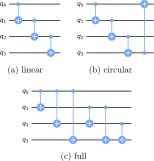
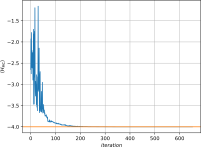

# What is VQE?

### Overview

What is VQE?

* variational hybrid quantum-classical algorithm
* aims to solve eigenvalue problems
* initially proposed to solve quantum chemistry problems [@peruzzo2014]
* makes even small quantum systems useful in conjunction with classical routines

How does it work?

1. prepares a trial state $\ket{\Psi(\vec{\theta})}$ on a quantum computer using a parametric circuit $U(\vec{\theta})$
2. evaluate cost function (expectation value) on qunatum computer
3. optimize $\vec{\Theta}$ using a classical computer
4. repeat until converged

### Applications

Applications so far include:

* quantum chemistry [@peruzzo2014; @mcclean2016]
* quantum magnets [@kandala2017]
* lattice gauge theories [@paulson2020]
* classical optimization problems [@farhi2014]

### Sketch of the Algorithm

{ height=70% }

### Circuit Structure

{ height=50% }

### Trial Wave Function

* quantum computer is initialized in some state, e.g. $\ket{\vec{0}}=\ket{0,0,\ldots,0}$
* layers of single-qubit gates and entanglement generators are applied alternatingly
*

With
$$
  U_j(\theta)=\bigotimes\limits_{i=1}^{N}U_{i,j}(\vec{\theta})
$$
the trial wave function reads:
$$
  \ket{\Psi(\theta)}=\left[\prod\limits_{j=1}^{N} U_j(\vec{\Theta}) U_{\mathrm{ent}}\right]U_0\ket{\vec{0}}
$$

### Entanglers

Typical entanglement operators are built from two-qubit gates:

{ height=70% }

# Max-Cut Problem

### Problem Statement

> Given a weighted graph $G$, find the maximum cut.

$\Leftrightarrow$ Partition vertices in two sets, such that the sum of edge
weights between the sets becomes maximal.

$\Leftrightarrow$ Maximize $C(\vec{x})=\sum\limits_{i,j}w_{i,j}x_i(1-x_j)$
($w_{i j}$: weights, $x_i\in\lbrace 0,1\rbrace$ label)

This problem is known to be:

* NP-hard $\Rightarrow$ no polynomial time algorithm
* NP-complete $\Rightarrow$ can be mapped to any other NP-complete problem

Literature [@moll2018]

### Example

{ height=90% }

### Spin-$\sfrac{1}{2}$-Hamiltonian

[@lucas2013]

1. shift binary variables: $x_i\in\lbrace 0,1\rbrace \to z_i=1-2x_i\in\lbrace -1,1\rbrace$
   $$C(\vec{z})=-\frac{1}{4}\sum\limits_{i,j}w_{ij}z_i z_j+\underbrace{\frac{1}{4}\sum\limits_{i,j}w_{ij}(1+z_j-z_i)}_{\text{const.}}$$
2. obtain Ising Hamiltonian using $z_i\to {\sigma}_i^{z}$ (neglecting constant term, the linear terms cancel each other):
   $$H_{\mathrm{I}}=-\frac{1}{2}\sum\limits_{i<j}w_{ij}{\sigma}_i^{z}{\sigma}_j^{z}$$
3. Max-Cut Problem is equivalent to finding the ground state of
   $$H_{\mathrm{MC}}=\frac{1}{2}\sum\limits_{i<j}w_{ij}{\sigma}_i^{z}{\sigma}_j^{z}$$

# Qiskit

### Qiskit [@Qiskit]

> Qiskit is an open source SDK for working with quantum computers at the level of pulses, circuits and application modules.

\hfill { height=4em }

* Python library
* allows to run quantum circuits on simulators (ideal and noisy including realistic noise models from actual hardware) and on a real quantum computer (**for free!**)
* many ready-made models, circuits and quantum algorithms (Short, VQE, QAOA, machine, etc.)
* allows to work on a very high level

# Quantum Approximate Optimization Algorithm

### QAOA: Convergence (Ideal)

{ height=70% }

### QAOA: Convergence (Noisy)

{ height=70% }

### QAOA Circuit

{ height=80% }

### QAOA Circuit

Problem: the QAOA ansatz generates a lot of gate operations:

* single-qubit (76x):
  * Hadamard (4x)
  * RZ (40x)
  * RX (32x)
* two-qubit (80x): CX gate

$\Rightarrow$ large accumulated gate error
(especially due to the two-qubit gates)

# VQE with ad hoc Ansatz

### Circuit

### Test

$$
RY(\theta)=\exp\left(-\frac{i}{2}\theta\sigma^{y}\right)=
  \begin{pmatrix}
    \cos\left(\sfrac{\theta}{2}\right) & -\sin\left(\sfrac{\theta}{2}\right) \\
    \sin\left(\sfrac{\theta}{2}\right) & \cos\left(\sfrac{\theta}{2}\right)
  \end{pmatrix}
$$
$$
CZ=\ket{0}\bra{0}\otimes I_{2\times 2}+\ket{1}\bra{1}\sigma^{z}=
  \begin{pmatrix}
    1 &   &   &    \\
      & 1 &   &    \\
      &   & 1 &    \\
      &   &   & -1
  \end{pmatrix}
$$

### VQE: Convergence (Ideal)

{ height=70% }

### VQE: Convergence (Noisy)

{ height=70% }

### References {.allowframebreaks}
