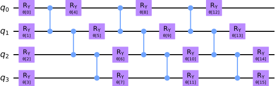

### VQE

{ height=70% }

### test

{ height=50% }

# Classical

### Combinatorial Optimization Problems

* classical problem specified by $n$ bits $x_i\in\lbrace x_i \rbrace$ and $m$ clauses $C_{\alpha}(\vec{x})$
* each $C_{\alpha}(\vec{x})$ operates on a subset (usually only a few) bits
* $C_{\alpha}(\vec{z})=1$ indicates that the clause is satisfied, $C_{\alpha}(\vec{z})=0$ that it is not
* goal: find the $\vec{z}$ that fulfills as many $C_{\alpha}(z)$ as possible (maximum satisfiability problem), i.e. maximize:
  $$C(\vec{z})=\sum\limits_{\alpha=1}^{m}C_{\alpha}(\vec{z})$$
* usually [@farhi2014]

### Max-Cut Problem: Statement

> Given a weighted graph $G$, find the maximum cut.

$\Leftrightarrow$ Partition vertices in two sets, such that the sum of edge
weights between the sets becomes maximal.

$\Leftrightarrow$ Maximize $C(\vec{x})=\sum\limits_{i,j}w_{i,j}x_i(1-x_j)$
($w_{i j}$: weights, $x_i\in\lbrace 0,1\rbrace$ label)

This problem is known to be:

* NP-hard $\Rightarrow$ no polynomial time algorithm
* NP-complete $\Rightarrow$ can be mapped to any other NP-complete problem

Literature [@moll2018]

### Max-Cut Problem: Example

### Max-Cut Problem: Spin-$\sfrac{1}{2}$-Hamiltonian

1. shift binary variables: $x_i\in\lbrace 0,1\rbrace \to z_i=1-2x_i\in\lbrace -1,1\rbrace$
   $$C(\vec{z})=-\frac{1}{4}\sum\limits_{i,j}w_{ij}z_i z_j+\underbrace{\frac{1}{4}\sum\limits_{i,j}w_{ij}(1+z_j-z_i)}_{\text{const.}}$$
2. obtain Ising Hamiltonian using $z_i\to {\sigma}_i^{z}$ (neglecting constant term, the linear terms cancel each other):
   $$H_{\mathrm{I}}=-\frac{1}{2}\sum\limits_{i<j}w_{ij}{\sigma}_i^{z}{\sigma}_j^{z}$$
3. Max-Cut Problem is equivalent to finding the ground state of
   $$H_{\mathrm{MC}}=\frac{1}{2}\sum\limits_{i<j}w_{ij}{\sigma}_i^{z}{\sigma}_j^{z}$$

### Circuit

### Test

$$
RY(\theta)=\exp\left(-\frac{i}{2}\theta\sigma^{y}\right)=
  \begin{pmatrix}
    \cos\left(\sfrac{\theta}{2}\right) & -\sin\left(\sfrac{\theta}{2}\right) \\
    \sin\left(\sfrac{\theta}{2}\right) & \cos\left(\sfrac{\theta}{2}\right)
  \end{pmatrix}
$$
$$
CZ=\ket{0}\bra{0}\otimes I_{2\times 2}+\ket{1}\bra{1}\sigma^{z}=
  \begin{pmatrix}
    1 &   &   &    \\
      & 1 &   &    \\
      &   & 1 &    \\
      &   &   & -1
  \end{pmatrix}
$$

### References
