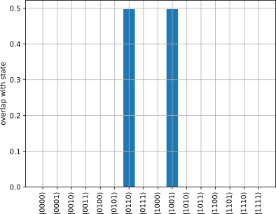
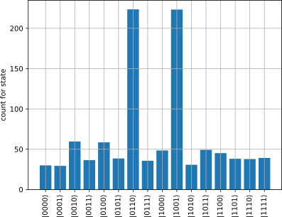
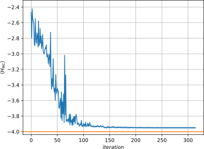

# Overview

### What is a VQE?

* variational quantum eigen solver (VQE)
* variational hybrid quantum-classical algorithm
* aims to solve eigenvalue problems and optimization problems that can be formulated as such
* initially proposed to solve quantum chemistry problems [@peruzzo2014]
* makes even small quantum systems useful in conjunction with classical routines

### How does it work?

1. prepares a trial state $\ket{\Psi(\vec{\theta})}$ on a quantum computer using a parametric circuit $U(\vec{\theta})$
2. evaluate cost function (expectation value) on the quantum computer
3. optimize $\vec{\Theta}$ using a classical computer
4. repeat until converged

After the optimal parameters $\vec{\theta}$ have been determined, one can measure the value of the cost function $\braket{\Psi(\theta)|H|\Psi(\theta)}$ and determine the eigenstate $\ket{\Psi(\theta)}$.

### Applications

Applications so far include:

* quantum chemistry [@peruzzo2014; @mcclean2016]
* quantum magnets [@kandala2017]
* lattice gauge theories [@paulson2020]
* classical optimization problems [@farhi2014]

### Sketch of the Algorithm

{ height=70% }

### Circuit Structure

{ height=50% }

### Trial Wave Function

* quantum computer is initialized in some state, e.g. $\ket{\vec{0}}=\ket{0,0,\ldots,0}$
* it might be useful to apply the Hadamard gate afterwards to get a superposition $\sfrac{1}{2}(\ket{0}+\ket{1})$
* layers of single-qubit gates and entanglement generators are applied alternatingly

With
$$
  U_j(\theta)=\bigotimes\limits_{i=1}^{N}U_{i,j}(\vec{\theta})
$$
the trial wave function reads:
$$
  \ket{\Psi(\theta)}=\left[\prod\limits_{j=1}^{N} U_j(\vec{\Theta}) U_{\mathrm{ent}}\right]U_0\ket{\vec{0}}
$$

### Entanglers

Typical entanglement operators are built using two-qubit gates:

{ height=70% }

# Max-Cut Problem

### Problem Statement

> Given a weighted graph $G$, find the maximum cut.

$\Leftrightarrow$ Partition vertices in two sets, such that the sum of edge
weights between the sets becomes maximal.

$\Leftrightarrow$ Maximize $C(\vec{x})=\sum\limits_{i,j}w_{i,j}x_i(1-x_j)$
 with weights $w_{i j}$ and binary labels $x_i\in\lbrace 0,1\rbrace$ (maximum satisfiability problem)

This problem is known to be:

* NP-hard $\Rightarrow$ no polynomial time algorithm
* NP-complete $\Rightarrow$ can be mapped to any other NP-complete problem

Literature: [@moll2018]

### Example

{ height=90% }

### Spin-$\sfrac{1}{2}$-Hamiltonian

1. shift binary variables: $x_i\in\lbrace 0,1\rbrace \to z_i=1-2x_i\in\lbrace -1,1\rbrace$
   $$C(\vec{z})=-\frac{1}{4}\sum\limits_{i,j}w_{ij}z_i z_j+\underbrace{\frac{1}{4}\sum\limits_{i,j}w_{ij}(1+z_j-z_i)}_{\text{const.}}$$
2. obtain Ising Hamiltonian using $z_i\to {\sigma}_i^{z}$ (neglecting constant term, the linear terms cancel each other):
   $$H_{\mathrm{I}}=-\frac{1}{2}\sum\limits_{i<j}w_{ij}{\sigma}_i^{z}{\sigma}_j^{z}$$
3. Max-Cut Problem is equivalent to finding the ground state of
   $$H_{\mathrm{MC}}=\frac{1}{2}\sum\limits_{i<j}w_{ij}{\sigma}_i^{z}{\sigma}_j^{z}$$

List of Ising formulations of NP-complete problems: [@lucas2013] (includes all of Karp's 21 NP-complete problems [@karp1972])

### Trial Wave Function

How to construct $\ket{\Psi(\vec{\theta})}$?

* it is unclear how to construct the trial wave function for classical problems
* the ansatz is usually developed heuristically
* the choice of gates is arbitary as long each qubit has access to the whole Bloch sphere

In quantum mechanical problems this is often much clearer.
For electronic structure problems one could use the Jordan-Wigner or the Bravyi-Kitaev transformation to translate the usual methods (e.g. unitary coupled cluster) to pauli matrices.

# Qiskit

### Qiskit [@Qiskit]

> Qiskit is an open source SDK for working with quantum computers at the level of pulses, circuits and application modules.

\hfill { height=4em }

* Python library
* allows to run quantum circuits on simulators (ideal and noisy including realistic noise models from actual hardware) and on a real quantum computer (**for free!**)
* many ready-made models, circuits and quantum algorithms (Short, VQE, QAOA, machine, etc.)
* allows to work on a very high level

# Quantum Approximate Optimization Algorithm (QAOA)

### Introduction

Consider a $N$-dimensional satisfiability problem with $m$ clauses $C_i(\vec{z})$.
The cost function reads
$$
  C(\vec{z})=\sum\limits_{i=1}^{m} C_i(\vec{z})
$$
with respect to $N$ binary labels
$$
  \vec{z}={\begin{pmatrix}z_1,z_2,\ldots,z_N\end{pmatrix}}^{\intercal}.
$$

QAOA [@farhi2014] is a heuristic approach controlled by an integer parameter $p\ge 1$ to generate the trial wave function:

* quality of the approximation improves with increasing p
* depth scales linearly $d\propto p m$
* $2p$ optimization parameters

### QAOA: Convergence (Ideal)

{ height=70% }

### QAOA: Eigenstate (Ideal)

{ height=70% }

### QAOA: Convergence (Noisy)

{ height=70% }

### QAOA: Eigenstate (Noisy)

{ height=70% }

### QAOA Circuit

{ height=80% }

### QAOA Circuit

Problem: the QAOA ansatz generates $156$ gate operations:

* single-qubit (76x):
  * Hadamard (4x)
  * RZ (40x)
  * RX (32x)
* two-qubit (80x): CX gate (CNOT)

$\Rightarrow$ large accumulated gate error due to imperfections/noise
(especially due to the two-qubit gates)

The ad hoc ansatz in the next section provides better results.

# VQE with ad hoc Ansatz

### Circuit

### VQE: Convergence (Ideal)

{ height=70% }

### VQE: Eigenstate (Ideal)

{ height=70% }

### VQE: Convergence (Noisy)

{ height=70% }

### VQE: Eigenstate (Noisy)

{ height=70% }

# Quantum Gates in This Presentation

### Quantum Gates (Single-Qubit)

Hadamard Gate:
$$
  H=\frac{1}{\sqrt{2}}\left(\sigma^x+\sigma^z\right)=\frac{1}{2}\begin{pmatrix}
    1 &  1 \\
    1 & -1
  \end{pmatrix}
$$

Rotation around $x$ axis:
$$
  RX(\theta)=\exp\left(-\frac{i}{2}\theta\sigma^{x}\right)=
    \begin{pmatrix}
      \cos\left(\sfrac{\theta}{2}\right) & -i\sin\left(\sfrac{\theta}{2}\right) \\
      -i\sin\left(\sfrac{\theta}{2}\right) & \cos\left(\sfrac{\theta}{2}\right)
    \end{pmatrix}
$$

Rotation around $y$ axis:
$$
  RY(\theta)=\exp\left(-\frac{i}{2}\theta\sigma^{y}\right)=
    \begin{pmatrix}
      \cos\left(\sfrac{\theta}{2}\right) & -\sin\left(\sfrac{\theta}{2}\right) \\
      \sin\left(\sfrac{\theta}{2}\right) & \cos\left(\sfrac{\theta}{2}\right)
    \end{pmatrix}
$$

### Quantum Gates (Two-Qubit)
Controlled $X$-gate (CNOT)
$$
CX=CNOT=I_{2\times 2}\otimes \ket{0}\bra{0}+\sigma^{x}\otimes\ket{1}\bra{1}=
  \begin{pmatrix}
    1 & 0 & 0 & 0 \\
    0 & 1 & 0 & 0 \\
    0 & 0 & 0 & 1 \\
    0 & 0 & 1 & 0
  \end{pmatrix}
$$

Controlled $Z$-gate (CNOT)
$$
CZ=\ket{0}\bra{0}\otimes I_{2\times 2}+\ket{1}\bra{1}\sigma^{z}=
  \begin{pmatrix}
    1 & 0 & 0 &  0 \\
    0 & 1 & 0 &  0 \\
    0 & 0 & 1 &  0 \\
    0 & 0 & 0 & -1
  \end{pmatrix}
$$

### {.plain}

**Thank you for your attention!**

Code: [\faGithub{} https://github.com/f-koehler/journal-club-vqs](https://github.com/f-koehler/journal-club-vqs)

### References {.allowframebreaks}
